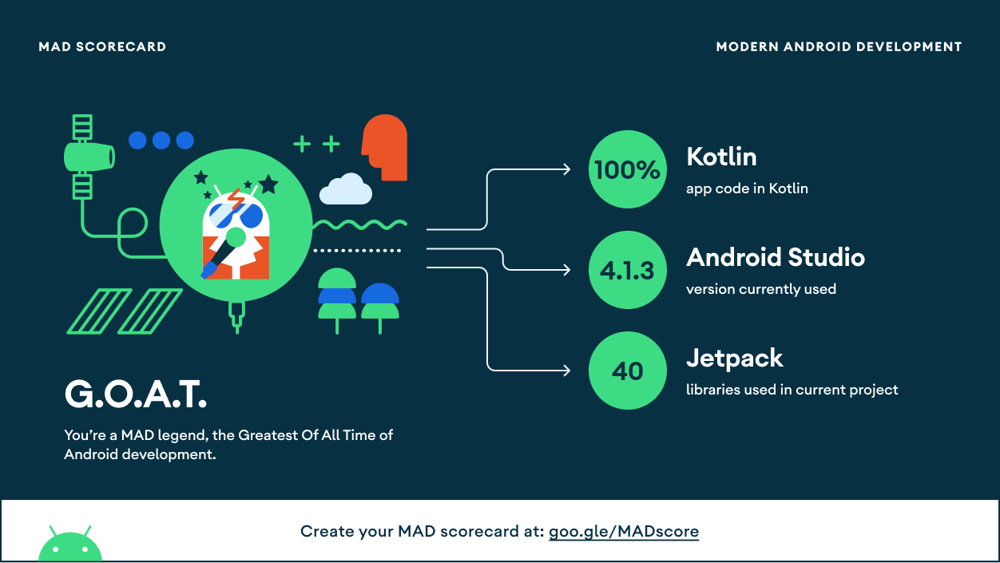
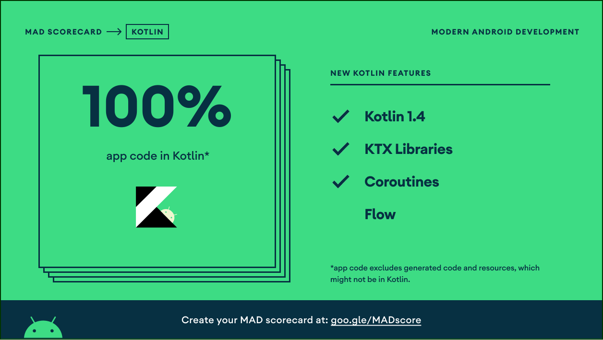
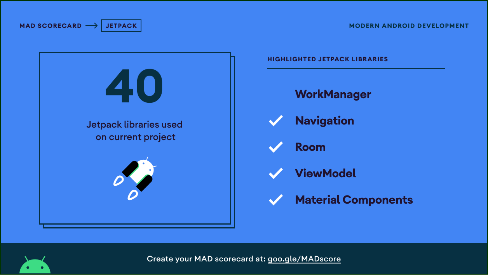
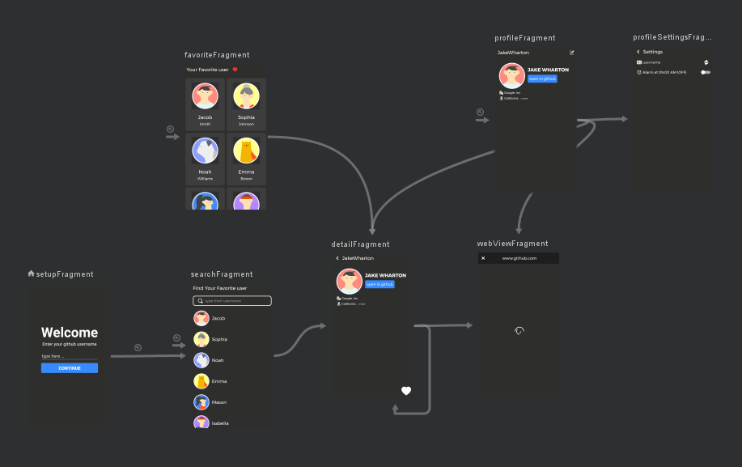

# Final Submission Dicoding Academy Android Apps Fundamental (GitHub User)
This apps i created for accomplish task from [Dicoding](https://www.dicoding.com/) on subject [BFFA](https://www.dicoding.com/academies/14), if you found this because you wanted to accomplish your final task from **Dicoding** also please use this as reference do not copy all of the code because it'll be counted as **Plagiarism**

## About Apps
i named this app *GitUser* 
this apps like as the name it's about to find out GitHub user through [GitHub API](https://docs.github.com/en/rest)

### Warning 
Before you clone you should create your own API KEY first, Because this project needed that KEY, if you don't know how to Generate and setup your API KEY GitHub you can visit [here](https://www.dicoding.com/blog/apa-itu-rate-limit-pada-github-api/) after that you can replace your API KEY in file *gradle.properties* and type API_KEY = "{YOUR API KEY}"

### The End Point i use 
- Search : [https://api.github.com/search/users?q={username}](https://api.github.com/search/users?q=isekaiweb) 
- Detail : [https://api.github.com/users/{username}](https://api.github.com/users/isekaiweb)
- Followers : [https://api.github.com/users/{username}/followers](https://api.github.com/users/isekaiweb/followers)
- Following : [https://api.github.com/users/{username}/following](https://api.github.com/users/isekaiweb/following)
- Repository : [https://api.github.com/users/{username}/repos](https://api.github.com/users/isekaiweb/repos)

### Features
- Search for GitHub user
- Save Favorite user
- Remove Favorite user
- See Detail About the user
- Open in web
- Alarm set on 09:00 AM
- Profile (profile sets by username that user type)
- Content Provider (it'll show the page from favorite users)
- Dark Theme Only (i'm not provide light theme in this apps)

#### Plus
- if username sets as profile's username it will can't set as user favorite and if already set as favorite it would remove automatically
- the keyword you last search it'll save and use to initial keyword for user search until you set it back again


## Tools
- [Lifecycle & LiveData](https://developer.android.com/jetpack/androidx/releases/lifecycle)
- [Navigation Component](https://developer.android.com/jetpack/androidx/releases/navigation)
- [Dagger Hilt](https://dagger.dev/hilt/)
- [Retrofit 2](https://square.github.io/retrofit/)
- [Glide](https://github.com/bumptech/glide)
- [MVVM](https://developer.android.com/jetpack/guide)
- [ROOM](https://developer.android.com/jetpack/androidx/releases/room)
- [Shimmer Facebook](https://facebook.github.io/shimmer-android/)
- [Smooth Loader](https://github.com/nntuyen/mkloader)
- [Smooth Bottom Navigation](https://github.com/ibrahimsn98/SmoothBottomBar)
- [View Binding](https://developer.android.com/topic/libraries/view-binding?hl=en)

## MAD SCORECARD




## Navigation Flow Apps


## Demo
if you want to see more detail you can simply visit the demo [here]()

## LICENSE

```

   Copyright © 2021 Abraham

   Licensed under the Apache License, Version 2.0 (the "License");
   you may not use this file except in compliance with the License.
   You may obtain a copy of the License at

        http://www.apache.org/licenses/LICENSE-2.0

   Unless required by applicable law or agreed to in writing, software
   distributed under the License is distributed on an "AS IS" BASIS,
   WITHOUT WARRANTIES OR CONDITIONS OF ANY KIND, either express or implied.
   See the License for the specific language governing permissions and
   limitations under the License.

```


